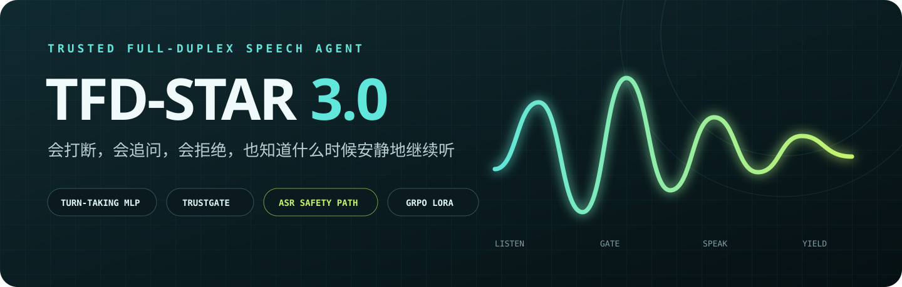
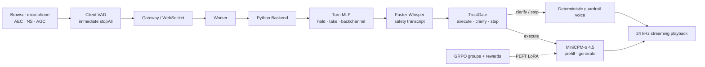
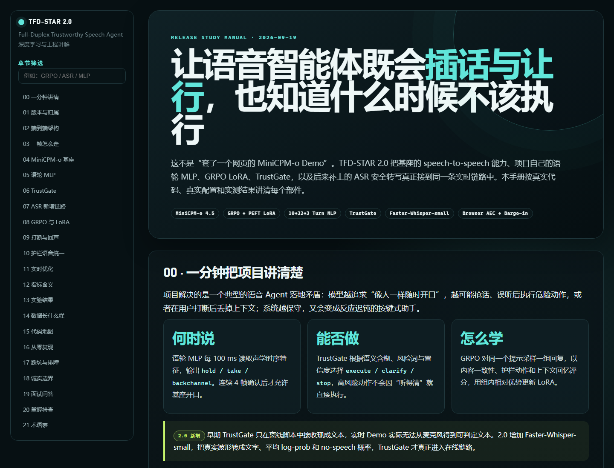

<p align="center">
  
</p>

<p align="center">
  <a href="https://github.com/Jatshi/trusted-full-duplex-agent/releases/tag/v2.0.0"></a>
  <a href="https://huggingface.co/jatshi/trusted-full-duplex-agent"></a>
  <a href="https://huggingface.co/datasets/jatshi/trusted-full-duplex-agent-data"></a>
  
  
</p>

<p align="center"><strong>可信全双工语音智能体</strong><br>
会打断，会追问，会拒绝，也知道什么时候安静地继续听。</p>

<p align="center">
  <a href="#-60-秒看懂项目">60 秒看懂</a> ·
  <a href="#-20-新增">2.0 新增</a> ·
  <a href="#-实测结果">实测结果</a> ·
  <a href="#-快速开始">快速开始</a> ·
  <a href="docs/TFD_STAR_2.0_全双工可信语音智能体_深度学习手册.html">深度学习手册</a> ·
  <a href="RELEASE_NOTES_v2.0.md">Release Notes</a>
</p>

---

## 60 秒看懂项目

TFD-STAR 以 [MiniCPM-o 4.5](https://huggingface.co/openbmb/MiniCPM-o-4_5)
作为 speech-to-speech 基座，在真实浏览器、WebSocket、Gateway、Worker 与
GPU backend 链路中加入三层项目能力：

1. **语轮决策层**：10 维流式声学特征 → 10-32-3 MLP →
   `hold / take / backchannel`，决定什么时候允许基座开口。
2. **可信控制层**：ASR 安全转写 → TrustGate →
   `execute / clarify / stop`，决定是否放行自由回答。
3. **后训练层**：GRPO + PEFT LoRA，用组内相对 reward 对齐安全动作与
   barge-in 后的上下文回忆。

2.0 不再是离线组件拼图：GRPO adapter、真实 MLP 权重、Faster-Whisper 与
TrustGate 已经接入同一实时 Demo，并用日志、metrics 和测试证明它们确实运行。

> **能力归属**：MiniCPM-o 负责多模态理解、listen/speak token、TTS 与
> token2wav；本项目负责时机决策、可信门控、GRPO 数据/训练、实时集成、
> 打断协议、评测与工程优化。两者在文档中始终分开标注。

## 系统架构



## 2.0 新增

| 模块 | 2.0 做了什么 | 对应代码 |
|---|---|---|
| **真实 ASR 安全链路** | Faster-Whisper-small CPU int8、中文繁简归一化、logprob/no-speech confidence、12s rolling window | `integrations/.../py_backend/tfd_runtime.py` |
| **在线语轮 MLP** | 100ms 帧、真实权重、四帧确认、voiced/silence 约束、实时概率 metrics | 同上 |
| **在线 GRPO LoRA** | adapter 挂入内部 `model.llm`，可与 baseline 显式切换 | `core/processors/pytorch_backend.py` overlay |
| **TrustGate 真接线** | 空噪声继续听；低风险 ASR 不确定退回 base；风险/含糊请求仍拦截 | `py_backend/server.py` overlay |
| **重复 ASR 修复** | voiced-frame watermark，沉默时不重复处理旧窗口 | `py_backend/server.py` overlay |
| **客户端即时打断** | 本地先停播放器，下一块 one-shot `force_listen` 追平服务器状态 | `realtime-session.js` overlay |
| **listen reason 协议** | 区分 `turn_end / model_listen / force_listen`，不再自我截尾 | backend + frontend overlay |
| **统一护栏音色** | clarify/stop 与正常对话统一为女声 | `outputs/duplex_session/*.wav` |
| **推理优化** | LoRA 后编译；默认只编译 TTS；localhost 700ms 抗抖缓冲 | backend + frontend overlay |
| **完整发布物** | 学习 HTML、集成 overlay、模型卡、发布清单、测试与 F 盘全量源码备份 | `docs/` + `release/v2.0/` |

详细变更见 [RELEASE_NOTES_v2.0.md](RELEASE_NOTES_v2.0.md)，工程与算法从头讲解见
[TFD-STAR 2.0 深度学习手册](docs/TFD_STAR_2.0_全双工可信语音智能体_深度学习手册.html)。

## 实测结果

### 2.0 在线链路

| 指标 | 实测 | 说明 |
|---|---:|---|
| TTS compile warm-up | 132.6 s（一次性） | adapter 加载后，默认只编译 TTS graph |
| backend latency | median **0.742 s**, mean **0.794 s** | 最新短探针，单会话 |
| client wall time | median **0.824 s**, mean **0.897 s** | SSH 直连入口 |
| Python integration tests | **10 passed** | adapter / MLP / ASR / Gate runtime |
| browser protocol tests | **10 passed** | 品牌、打断、compile keepalive 契约 |

> 公网 Gradio 中继曾把约 0.7 秒模型生成放大为 2.3~4.2 秒。SSH 直连恢复到
> 1 秒内，说明当时主要瓶颈是传输与缓冲，不是 32GB 4080 的显存容量。

### 研究与训练层

| 能力 | 结果 | 证据边界 |
|---|---:|---|
| Turn MLP 帧分类 | val accuracy **96.46%** | 参数化合成数据 hold-out |
| Turn MLP 事件评测 | 假开口 **0%**、漏接 **0%**、take median 553.9ms | 150 条合成话语，四帧确认 |
| barge-in 机制 | 100/200/500ms chunk 总延迟 300/400/566.7ms | 本地机制评测 |
| Qwen2.5-1.5B GRPO | context recall 0.301→**0.484** | 20 steps，真实 LoRA 梯度 |
| MiniCPM-o 9B GRPO | 最佳 reward **+0.015**；多数组合退化 | 小增益接近约 ±0.08 采样噪声 |
| 真基座打断 A/B | probe bigram 0.000→**0.089** | 揭示截断时机、近因偏置与模态 gap |

我们保留 9B 的全部负结果，因为“强基座 + 小数据 + 小 group”并不保证 RL 会提升。
详细报告在 [MANIFEST.md](MANIFEST.md) 和
[V2_ARCHITECTURE_AND_RESULTS.md](docs/V2_ARCHITECTURE_AND_RESULTS.md)。

## 核心算法

### Turn-taking MLP

每 100ms 提取能量、连续停顿、能量斜率、1/3s 语音占比、累计语音、内部停顿、
停顿前语音长度、最后 voiced 能量和尾部下降量等 10 维因果特征：

```text
x[10] → Linear(10,32) → ReLU → Linear(32,3)
                                 hold / take / backchannel
```

训练使用带类别权重的交叉熵；部署端连续四帧预测 take 才真正开口，用延迟换低抢话率。

### TrustGate

```text
score = risk × (1 - confidence)
```

但决策不是只看 score：语义含糊单独追问；低置信+风险直接停止；风险 ≥0.4 至少确认，
风险 ≥0.8 停止。ASR 只是安全监视器，低风险不确定会让原始音频回到 MiniCPM-o，
避免“任何动静都 clarify”。

### GRPO + LoRA

同一 prompt 采样一组候选，按 reward 做组内 z-score：

```text
A_i = (r_i - mean(r)) / (std(r) + eps)
L = -mean(A_i · log πθ(y_i|x)) + β · mean(logπθ - logπref)
```

- 安全族 reward：BLEU-1 内容一致性 + `execute/clarify/stop` 动作一致性；
- barge-in 族 reward：字符 bigram Jaccard 上下文回忆 + BLEU-1；
- LoRA：`r=16, alpha=32, dropout=0.05, target=all-linear`；
- LoRA reference：`disable_adapter()` 获得冻结基座，无需再复制一份 9B 模型。

## 快速开始

### CPU：验证算法与证据

```bash
git clone https://github.com/Jatshi/trusted-full-duplex-agent.git
cd trusted-full-duplex-agent
pip install -r requirements_minicpmo.txt

python scripts/60_turntaking_train.py
python scripts/61_turntaking_eval.py
python scripts/64_gate_incremental.py
python -m pytest tests -q
```

### GPU：训练 GRPO adapter

```bash
bash scripts/run_autodl.sh setup

python scripts/32_run_grpo.py --real \
  --model /path/to/MiniCPM-o-4_5 \
  --data data/rl_streams/bargein_context.jsonl \
  --lr 1e-5 --group-size 4
```

### GPU：运行完整 2.0 Demo

主仓库只发布可审查的差异补丁与本项目新增文件，不复制整个上游 Demo：

```bash
git clone https://github.com/OpenBMB/MiniCPM-o-Demo.git MiniCPM-o-Demo
python integrations/minicpmo45-demo/apply_integration.py MiniCPM-o-Demo

cp integrations/minicpmo45-demo/tfd-runtime.env.example /secure/path/tfd.env
# 修改模型、adapter、MLP、ASR 的绝对路径
set -a; . /secure/path/tfd.env; set +a
```

然后按匹配的 MiniCPM-o-Demo upstream revision 启动 backend、worker、gateway。
集成细节与测试命令见
[integrations/minicpmo45-demo/README.md](integrations/minicpmo45-demo/README.md)。

## Hugging Face 资产

- [模型仓库](https://huggingface.co/jatshi/trusted-full-duplex-agent)：GRPO LoRA、
  turn-taking MLP、2.0 runtime config、结果与模型卡；
- [数据与证据仓库](https://huggingface.co/datasets/jatshi/trusted-full-duplex-agent-data)：
  GRPO JSONL、turn-taking frames、用户语音与端到端报告。

基础 MiniCPM-o、Qwen 与 Faster-Whisper 权重不重复上传。请从各自官方仓库下载，并遵守其许可。

## 仓库导航

```text
configs/                         base / gate / RL / turn-taking 配置
src/tfd/
  base/                          基座接口
  gate/                          confidence / risk / ambiguity / TrustGate
  turntaking/                    10维特征、MLP、barge-in
  rl/                            reward 与可微 GRPO trainer
  eval/                          全双工指标
scripts/                         00~66 训练、评测、录制与部署入口
integrations/minicpmo45-demo/    2.0 在线 Demo overlay 与环境变量模板
data/                            可复现训练数据
outputs/                         JSON/WAV 证据；大权重走 Hugging Face
docs/                            深度学习 HTML、延迟诊断与架构说明
release/v2.0/                    发布 manifest、hash 与验证报告
```

## 文档

<p align="center">
  <a href="docs/TFD_STAR_2.0_全双工可信语音智能体_深度学习手册.html">
    
  </a>
</p>

- [TFD-STAR 2.0 全双工可信语音智能体深度学习手册](docs/TFD_STAR_2.0_全双工可信语音智能体_深度学习手册.html)
- [2.0 架构与证据摘要](docs/V2_ARCHITECTURE_AND_RESULTS.md)
- [F 盘全量归档与远端快照说明](docs/F_DRIVE_ARCHIVE_MANIFEST_2.0.md)
- [全双工 Demo 延迟与误打断诊断](docs/FULL_DUPLEX_LATENCY_PROFILE_20260918.md)
- [完整产物与复现清单](MANIFEST.md)
- [2.0 发布说明](RELEASE_NOTES_v2.0.md)

## 诚实边界

- Turn MLP 的强指标来自合成声学，尚需真人双人对话域外验证。
- 9B GRPO 的最佳正增益很小，且多数 sweep 退化；它是完整训练/部署闭环，
  不是“RL 必然提升强基座”的证据。
- WebSocket Float32 PCM、单会话与 SSH tunnel 是研究部署；生产化还需要
  HTTPS/WSS、鉴权、并发、丢包、长稳和审计。
- 基座模型能力属于 OpenBMB。本项目不会把上游能力包装成自研训练结果。

## Citation

```bibtex
@software{shi2026tfdstar,
  author  = {Jianting Shi},
  title   = {TFD-STAR 2.0: Trusted Full-Duplex Speech Agent},
  year    = {2026},
  url     = {https://github.com/Jatshi/trusted-full-duplex-agent},
  version = {2.0.0}
}
```

## Acknowledgements

Built on [OpenBMB MiniCPM-o 4.5](https://github.com/OpenBMB/MiniCPM-o) and the
[MiniCPM-o-Demo](https://github.com/OpenBMB/MiniCPM-o-Demo) serving stack.
Faster-Whisper is used only as an optional safety transcription dependency.
Review upstream licenses before redistributing a combined deployment.
