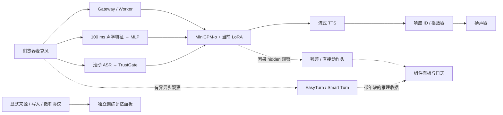

<p align="center">
  
</p>

<p align="center">
  <a href="https://github.com/Jatshi/trusted-full-duplex-agent/releases/tag/v3.0.0"></a>
  <a href="https://huggingface.co/jatshi/trusted-full-duplex-agent"></a>
  <a href="https://huggingface.co/datasets/jatshi/trusted-full-duplex-agent-data"></a>
  
  
</p>

<p align="center"><strong>听、说、打断、续讲，让语音交互拥有清晰的控制边界。</strong><br>
流式语音底座 × 学习式语轮判断 × 可信执行 × 可切换训练组件</p>

<p align="center">
  <a href="#项目概览">概览</a> · <a href="#系统架构">架构</a> ·
  <a href="#组件设计">组件设计</a> · <a href="#训练与模型">训练</a> ·
  <a href="#快速开始">快速开始</a> · <a href="#demo-模式">Demo 模式</a> ·
  <a href="RELEASE_NOTES_v3.0.md">3.0 Release Notes</a>
</p>

## 项目概览

TFD-STAR（Trusted Full-Duplex Speech Agent）是一个以
[MiniCPM-o 4.5](https://huggingface.co/openbmb/MiniCPM-o-4_5) 为 speech-to-speech 底座的可信全双工语音系统。
它把“听到声音”“判断语轮”“生成回答”“执行指令”和“停止播放”拆成可观察、可配置的环节，
在浏览器、WebSocket、Gateway、Worker 和模型后端之间保持一致的会话语义。

项目从端到端语音交互逐步扩展：1.x 建立流式对话和可信执行链路；2.0 加入声学语轮 MLP、
滚动 ASR 安全路径及 GRPO LoRA；3.0 将显式响应生命周期、限定续讲、动作头观察、
语义语轮观察、六个可切换 SFT LoRA 和训练记忆协议面板整合进同一 Demo。
原有训练、评测、数据工具和 2.0 恢复入口继续保留。

| 层次 | 关注的问题 | 实现 |
| :-- | :-- | :-- |
| 声学语轮 | 停顿是句中犹豫，还是交接？ | 流式 10 维特征、轻量 MLP、连续帧确认 |
| 语义观察 | 用户的话是否完整，是否只是附和？ | EasyTurn、Smart Turn 的有界异步旁路 |
| 可信执行 | 不确定的高风险语音应怎样处理？ | Faster-Whisper、TrustGate、执行 / 澄清 / 停止分支 |
| 响应控制 | 谁拥有当前回答，哪些音频仍然有效？ | CFDC 响应 ID、生命周期、取消归属、播放器清理 |
| 学习组件 | 怎样研究和切换不同训练策略？ | GRPO / SFT LoRA、残差与直接动作头、因果策略接口 |
| 来源记忆 | 信息来自谁，撤销后还能使用什么？ | 可撤销证据记忆模型与独立协议面板 |

**职责划分：** MiniCPM-o 提供音频编码、语音语言模型和 TTS 等基础能力；
本项目提供语轮特征与训练、可信门控、响应控制、适配器隔离、组件接线和可复现工具。
EasyTurn 与 Smart Turn 使用各自上游模型，明确标注为外部语义组件。

## 系统架构



实线表示主回答或播放控制链路；虚线表示不接管回答的观察路径。
独立记忆面板处理显式协议事件，与麦克风会话分开。
这种分层让用户能分别体验主链路、训练适配器和观察组件，而无需把所有模型强行叠加。

## 组件设计

### 1. 流式声学语轮 MLP

语轮判断需要区分“话说完了”和“话说到一半停了一下”。逐帧特征器只读取当前及历史声音，
提取能量、连续静音时长、能量趋势、1 秒 / 3 秒语音比例、累计发声时间、句中停顿次数、
停顿前发声时长、末帧语音能量及尾部能量下降，共 10 维。

轻量 MLP 将这些特征映射到语轮类别；运行时以 100 ms 帧更新，并用连续帧确认减少瞬时抖动。
特征器和预测器与音频模型解耦，支持 CPU 推理、离线训练和逐帧审计。

代码：[`features.py`](src/tfd/turntaking/features.py)、
[`predictor.py`](src/tfd/turntaking/predictor.py)、
[`60_turntaking_train.py`](scripts/60_turntaking_train.py)。

### 2. EasyTurn 与 Smart Turn 语义语轮观察

声学停顿之外，还需要观察语言和上下文是否形成完整表达。3.0 的组件模式并行接入：

- **EasyTurn：** 官方音频前端与语义模型，输出 complete、incomplete、backchannel、wait 四类。
- **Smart Turn v3.2：** CPU ONNX 推理，输出话语完成概率。
- **有界异步调度：** 最近 8 秒音频前缀、2 秒采样间隔、最多一个待处理请求；会话取消后丢弃旧结果。
- **可解释收据：** 记录模型标识、资产哈希、输入范围、推理耗时与结果年龄。

这些结果在 `v3_components` 中以**旁路**方式展示，不阻塞主回答，也不直接决定停音。
它们与本项目的因果 Transformer 策略接口是两个不同层次：前者是实际 Demo 语义观察组件，
后者是可训练的策略研究接口。

代码：[`demo_observers.py`](src/tfd/duplex_policy/demo_observers.py)、
[`smart_turn_pretrained.py`](src/tfd/turntaking/smart_turn_pretrained.py)、
[语义侧车](integrations/minicpmo45-demo-v3/sidecars/observer_service.py)。

### 3. 滚动 ASR 与 TrustGate

语音生成可以直接走端到端模型；涉及执行的语义则通过滚动 Faster-Whisper 路径观察。
系统保留时间窗、ASR 置信度和输入进度水位，避免把重复或过期转写当成新指令。

TrustGate 联合操作风险与置信度，输出 execute、clarify 或 stop。
低风险对话保持直接回答；不确定的敏感操作转入澄清或拒绝路径。
门控决定与原始模型输出分别记账，便于检查语音理解和控制行为。

代码：[`trust_gate.py`](src/tfd/gate/trust_gate.py)、
[`features.py`](src/tfd/gate/features.py)、[运行时接线](integrations/minicpmo45-demo-v3/overlay/py_backend/tfd_runtime.py)。

### 4. CFDC：显式响应生命周期与限定续讲

声音流的一次 LISTEN 并不总意味着逻辑回答已经结束。CFDC 将模型片段、逻辑响应和客户端播放拆开：

- 每个响应有独立 ID，普通 LISTEN 与自然结束分开记录。
- 取消和结束消息必须属于当前响应；迟到音频不能重新进入已取消的播放队列。
- 浏览器停止当前播放并发送取消；后端收回响应归属，清理相关流状态。
- 限定续讲只使用本会话内、被打断的低风险回答上下文，并经过置信度检查及一次性消费。

3.0 提供响应跟踪和实验生命周期配置。浏览器取消能力与受控近端回放开关独立；
真实麦克风不依赖 raw Silero 自动抢占播放。

代码：[`response_lifecycle.py`](src/tfd/duplex_policy/response_lifecycle.py)、
[`tfd_response_context.py`](integrations/minicpmo45-demo-v3/overlay/py_backend/tfd_response_context.py)；
浏览器与传输修改见 [Demo 集成补丁](integrations/minicpmo45-demo-v3/tfd-star-v3.patch)。

### 5. 因果动作头与 Transformer 策略接口

动作头读取模型因果前缀的 4096 维 hidden，学习 LISTEN / SPEAK 的小动作空间。
残差头在原生动作 logits 上学习修正，直接头学习独立映射。
Demo 的动作观察模式加载三个残差 seed 和一个直接头，记录每块预测、耗时及 checkpoint 哈希，
不改写主模型 logits 或取消决策。

研究侧 `CausalDuplexPolicy` 提供快声学分支、慢语义分支和带因果掩码的 Transformer 融合，
将语轮动作、时序与风险输出统一为可训练接口。该接口以源码与测试形式提供；
当前 Demo 的语义观察由 EasyTurn / Smart Turn 承担。

代码：[`src/tfd/duplex_policy`](src/tfd/duplex_policy)、
[`test_duplex_policy_v3.py`](tests/test_duplex_policy_v3.py)。

### 6. 会话级 LoRA 切换

3.0 可配置两组文本 SFT 适配器，各包含 seed 42 / 43 / 44，连同原有 GRPO adapter 提供会话级切换。
候选 adapter **替换而非叠加**默认 adapter；每份权重在加载时验证文件哈希和实际模型张量。

适配器使用独占租约：会话创建时选择，结束时清理 KV / 音频 / TTS 状态并恢复默认。
实验适配器保持 eager LLM，TTS 编译开关单独管理。
缺少真实 checkpoint 时，LoRA 模式明确报错，不静默回退成基线。

代码：[`demo_lora.py`](src/tfd/duplex_policy/demo_lora.py)；
资产配置见 [V3_ASSETS.md](docs/V3_ASSETS.md)。

### 7. 可撤销证据记忆

记忆组件将来源标签、写入事件、查询和撤销事件作为显式输入。
可撤销记忆围绕来源状态更新和失效信息管理设计，同时保留 GRU、无清除与规则对照。

Demo 的独立协议面板加载 18 份训练 checkpoint，展示全部配置和 seed 的推理结果。
它使用与训练契约一致的 MiniCPM 事件文本特征缓存及 train-only 归一化，
处理限定协议表达；不修改主对话的 KV，也不接管语音回答。

代码：[记忆研究模块](research/revocable_memory)、
[协议面板](integrations/minicpmo45-demo-v3/sidecars/memory)。

## 训练与模型

| 模块 | 训练或来源 | 运行位置 |
| :-- | :-- | :-- |
| 声学语轮 MLP | 项目训练：声学帧特征与语轮标签 | 主链路 CPU |
| GRPO LoRA | 项目后训练：组相对奖励与 LoRA 更新 | 主回答 |
| 两组 SFT LoRA × 三 seed | 项目文本后训练 | 可选主回答 |
| 残差 / 直接动作头 | 项目训练：因果 hidden 与动作监督 | Demo 观察模式 |
| 可撤销记忆及对照 | 项目训练：显式来源与撤销协议 | 独立协议面板 |
| EasyTurn / Smart Turn | 上游预训练模型 | CPU 语义旁路 |
| 因果 Transformer 策略 | 项目模型结构、训练接口与测试 | 研究模块 |

GRPO 管线围绕语义执行、风险处理与语轮行为构造奖励，支持组内相对优势、KL 约束和 LoRA 参数更新。
MLP、动作头与记忆模型各自具有独立的特征契约、训练目标和 checkpoint。
模型、数据与训练入口不等同于一个统一训练的大模型；各组件的依赖与接入方式分别记录。

现有公开模型和数据入口：
[模型 / GRPO adapter](https://huggingface.co/jatshi/trusted-full-duplex-agent)、
[数据与复现材料](https://huggingface.co/datasets/jatshi/trusted-full-duplex-agent-data)。
3.0 GitHub 发布包为**源码与集成补丁**，不附带第三方大模型、六份新 SFT 权重、动作头权重、
记忆权重或私人会话录音。可选模式需按资产指南配置相应 checkpoint。

## 快速开始

### 项目与离线工具

```bash
git clone https://github.com/Jatshi/trusted-full-duplex-agent.git
cd trusted-full-duplex-agent
git checkout v3.0.0
python -m pip install -r requirements.txt
python -m pytest -q tests
```

声学语轮训练与离线评测、GRPO、数据构建及原有复现命令见
[2.0 手册](docs/TFD_STAR_2.0_全双工可信语音智能体_深度学习手册.html)、
[2.0 发布说明](RELEASE_NOTES_v2.0.md)和 [scripts](scripts)。

### MiniCPM-o Demo 集成

```bash
git clone https://github.com/OpenBMB/MiniCPM-o-Demo.git
git -C MiniCPM-o-Demo checkout 47709a9210dfd71afa76c058e017fc8c4db5c8d2
python integrations/minicpmo45-demo-v3/apply_integration.py MiniCPM-o-Demo --check
python integrations/minicpmo45-demo-v3/apply_integration.py MiniCPM-o-Demo
```

安装 Demo 上游依赖，准备 MiniCPM-o、GRPO、MLP、ASR 与可选组件资产，再按
[部署指南](integrations/minicpmo45-demo-v3/README.md)启动后端、Worker、Gateway 和所需侧车。
配置样例使用外部环境文件；不要把凭据或模型缓存提交进 Git。

## Demo 模式

| 模式 | 接入内容 |
| :-- | :-- |
| `v2_reference` | 发布 2.0 服务端路径；保留当前浏览器 UI |
| `v3_engineering` | 主链路、响应跟踪与限定续讲 |
| `v3_shadow` | Engineering + 四个因果动作头观察 |
| `v3_components` | Engineering + 动作头、EasyTurn / Smart Turn 异步观察 |
| `v3_lora_e127_s42/43/44` | 第一组 SFT adapter，会话独占 |
| `v3_lora_e134_s42/43/44` | 第二组 SFT adapter，会话独占 |
| 记忆协议面板 | 独立 CPU 事件记忆推理，不进入主麦克风路径 |

选择模式后创建新会话，组件收据和 session ID 与日志关联。
模式中的“观察”意味着实际模型推理，但没有主回答控制权。
测试时可分别尝试句中停顿、附和、插话、停止、低风险续讲及需要澄清的执行指令。

## 仓库导航

```text
src/tfd/
  base/             模型与后端抽象
  front/            ASR 与语音前端
  gate/             风险、置信度与可信执行
  turntaking/       声学特征、MLP、语轮与 Smart Turn
  rl/               GRPO、奖励和训练工具
  duplex_policy/    因果策略、动作头、响应控制、Demo 组件
integrations/
  minicpmo45-demo/      2.0 集成入口
  minicpmo45-demo-v3/   3.0 补丁、owned overlay、侧车和安装校验
research/revocable_memory/   记忆模型与协议研究
scripts/              训练、评测、数据与复现
tests/                核心与组件测试
docs/                 设计、资产和历代手册
```

进一步阅读：[3.0 设计](docs/V3_DESIGN.md) · [资产配置](docs/V3_ASSETS.md) ·
[部署](integrations/minicpmo45-demo-v3/README.md) · [3.0 发布说明](RELEASE_NOTES_v3.0.md)。

## 部署与数据边界

服务默认绑定 loopback，通过本机或 SSH 隧道访问。若对公网部署，需要额外配置 TLS、
鉴权、访问控制和资源限制。会话日志与音频保留在自己的运行目录，不自动进入训练集或公开发布包。
浏览器的 echo cancellation 与后端观察策略分开；raw Silero 仅用于明确无回声的受控回放。

## 致谢与引用

感谢 OpenBMB / MiniCPM-o、EasyTurn、Pipecat Smart Turn、Qwen、
Faster-Whisper、PyTorch 和 Hugging Face 生态。第三方代码与权重按各自许可和模型卡使用；
本仓库提供对上游 Demo 的增量补丁，不替代上游安装与许可要求。

```bibtex
@misc{tfdstar2026,
  title = {TFD-STAR: Trusted Full-Duplex Speech Agent},
  author = {Jatshi},
  year = {2026},
  howpublished = {https://github.com/Jatshi/trusted-full-duplex-agent},
  note = {Version 3.0.0}
}
```
